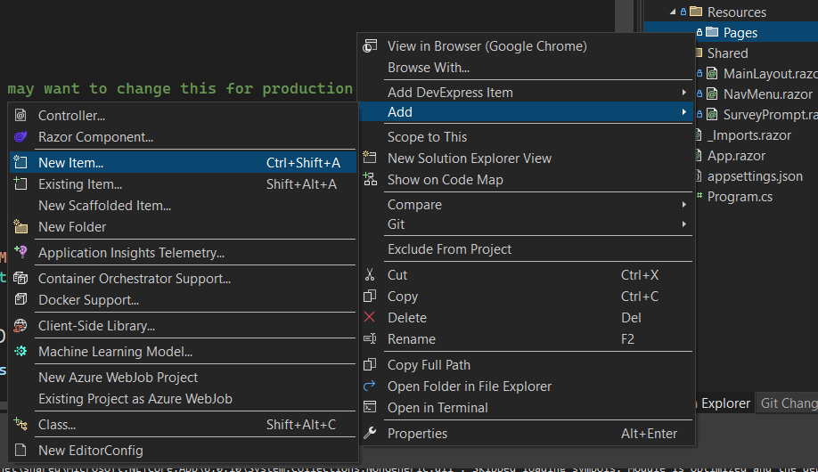
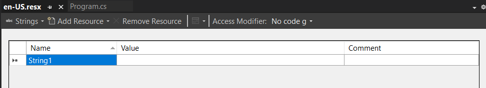
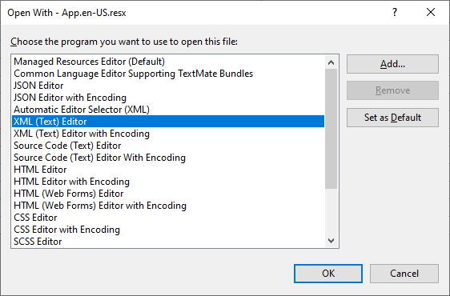
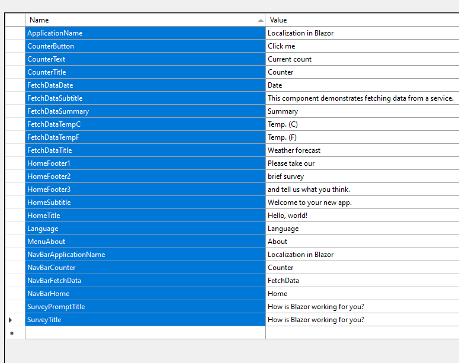
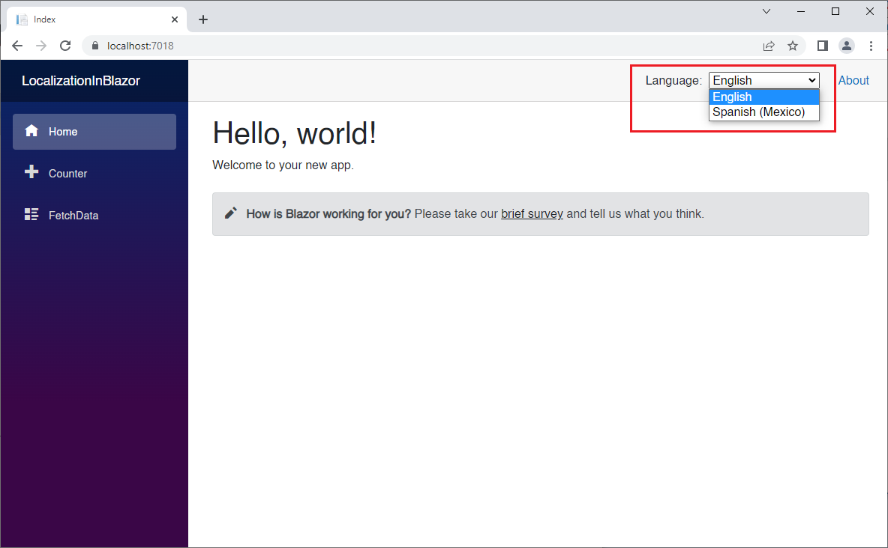
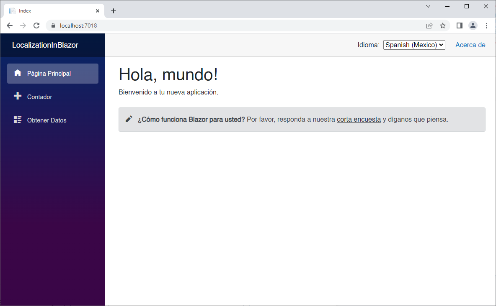

# Localization in Blazor Server

In this episode, we are going to build a **Blazor Server** application, and we are going to add localization support.

We will make use of the `Microsoft.Extensions.Localization` NuGet package, to leverage localization services, such as the `AddLocalization` service, and the `IStringLocalizer` interface.

We will create an enumeration for all of our resource strings and use them in our app to avoid magic string typos.

At the end of the demo, we will have the default **Blazor Server** template application, with support for English and Spanish.

Let's get to it.

### Create a Blazor Application

Create a new **Blazor Server** project called **LocalizationDemo**.

We are going to set the application's culture, and in order to use that we need the `Microsoft.Extensions.Localization` NuGet package.

Add the [Microsoft.Extensions.Localization](https://www.nuget.org/packages/Microsoft.Extensions.Localization,) by running the following command in the **Package Manager Console**.

```powershell
Install-Package Microsoft.Extensions.Localization
```

Alternatively, you can add this package reference in your *LocalizationInBlazor.csproj* file:

```xml
<PackageReference Include="Microsoft.Extensions.Localization" Version="6.0.10" />
```

We need a place to store our resource files in different languages. In our demo we will support two languages: English and Spanish. 

Create a *Resources* folder at the root level, and add a file called *App.en-US.resx*.

  

The file will be displayed in the **Resource** editor, with one String resource by default.

  

You can delete the default resource, or rename it. We are going to add all the English resource strings we need to display our application in English. 

> ***NOTE:*** You can add these values manually if you like, to get familiar with the UI, but I will also provide the actual **XML** of the resource files, so you can just copy and paste.

| Name                  | Value                                                     |
| --------------------- | --------------------------------------------------------- |
| ApplicationName       | Localization in Blazor                                    |
| CounterButton         | Click me                                                  |
| CounterText           | Current count                                             |
| CounterTitle          | Counter                                                   |
| FetchDataDate         | Date                                                      |
| FetchDataSubtitle     | This component demonstrates fetching data from a service. |
| FetchDataSummary      | Summary                                                   |
| FetchDataTempC        | Temp. (C)                                                 |
| FetchDataTempF        | Temp. (F)                                                 |
| FetchDataTitle        | Weather forecast                                          |
| HomeFooter1           | Please take our                                           |
| HomeFooter2           | brief survey                                              |
| HomeFooter3           | and tell us what you think.                               |
| HomeSubtitle          | Welcome to your new app.                                  |
| HomeTitle             | Hello, world!                                             |
| Language              | Language                                                  |
| MenuAbout             | About                                                     |
| NavBarApplicationName | Localization in Blazor                                    |
| NavBarCounter         | Counter                                                   |
| NavBarFetchData       | FetchData                                                 |
| NavBarHome            | Home                                                      |
| SurveyPromptTitle     | How is Blazor working for you?                            |

Resource files are nothing but **XML** files, in order to view the code, right-click on the resource file, and select **Open With** from the menu. Then select **XML (Text) Editor**, and then OK.

 

Replace the XML with the following:

```xml
<?xml version="1.0" encoding="utf-8"?>
<root>
  <!-- 
    Microsoft ResX Schema 
    
    Version 2.0
    
    The primary goals of this format is to allow a simple XML format 
    that is mostly human readable. The generation and parsing of the 
    various data types are done through the TypeConverter classes 
    associated with the data types.
    
    Example:
    
    ... ado.net/XML headers & schema ...
    <resheader name="resmimetype">text/microsoft-resx</resheader>
    <resheader name="version">2.0</resheader>
    <resheader name="reader">System.Resources.ResXResourceReader, System.Windows.Forms, ...</resheader>
    <resheader name="writer">System.Resources.ResXResourceWriter, System.Windows.Forms, ...</resheader>
    <data name="Name1"><value>this is my long string</value><comment>this is a comment</comment></data>
    <data name="Color1" type="System.Drawing.Color, System.Drawing">Blue</data>
    <data name="Bitmap1" mimetype="application/x-microsoft.net.object.binary.base64">
        <value>[base64 mime encoded serialized .NET Framework object]</value>
    </data>
    <data name="Icon1" type="System.Drawing.Icon, System.Drawing" mimetype="application/x-microsoft.net.object.bytearray.base64">
        <value>[base64 mime encoded string representing a byte array form of the .NET Framework object]</value>
        <comment>This is a comment</comment>
    </data>
                
    There are any number of "resheader" rows that contain simple 
    name/value pairs.
    
    Each data row contains a name, and value. The row also contains a 
    type or mimetype. Type corresponds to a .NET class that support 
    text/value conversion through the TypeConverter architecture. 
    Classes that don't support this are serialized and stored with the 
    mimetype set.
    
    The mimetype is used for serialized objects, and tells the 
    ResXResourceReader how to depersist the object. This is currently not 
    extensible. For a given mimetype the value must be set accordingly:
    
    Note - application/x-microsoft.net.object.binary.base64 is the format 
    that the ResXResourceWriter will generate, however the reader can 
    read any of the formats listed below.
    
    mimetype: application/x-microsoft.net.object.binary.base64
    value   : The object must be serialized with 
            : System.Runtime.Serialization.Formatters.Binary.BinaryFormatter
            : and then encoded with base64 encoding.
    
    mimetype: application/x-microsoft.net.object.soap.base64
    value   : The object must be serialized with 
            : System.Runtime.Serialization.Formatters.Soap.SoapFormatter
            : and then encoded with base64 encoding.

    mimetype: application/x-microsoft.net.object.bytearray.base64
    value   : The object must be serialized into a byte array 
            : using a System.ComponentModel.TypeConverter
            : and then encoded with base64 encoding.
    -->
  <xsd:schema id="root" xmlns="" xmlns:xsd="http://www.w3.org/2001/XMLSchema" xmlns:msdata="urn:schemas-microsoft-com:xml-msdata">
    <xsd:import namespace="http://www.w3.org/XML/1998/namespace" />
    <xsd:element name="root" msdata:IsDataSet="true">
      <xsd:complexType>
        <xsd:choice maxOccurs="unbounded">
          <xsd:element name="metadata">
            <xsd:complexType>
              <xsd:sequence>
                <xsd:element name="value" type="xsd:string" minOccurs="0" />
              </xsd:sequence>
              <xsd:attribute name="name" use="required" type="xsd:string" />
              <xsd:attribute name="type" type="xsd:string" />
              <xsd:attribute name="mimetype" type="xsd:string" />
              <xsd:attribute ref="xml:space" />
            </xsd:complexType>
          </xsd:element>
          <xsd:element name="assembly">
            <xsd:complexType>
              <xsd:attribute name="alias" type="xsd:string" />
              <xsd:attribute name="name" type="xsd:string" />
            </xsd:complexType>
          </xsd:element>
          <xsd:element name="data">
            <xsd:complexType>
              <xsd:sequence>
                <xsd:element name="value" type="xsd:string" minOccurs="0" msdata:Ordinal="1" />
                <xsd:element name="comment" type="xsd:string" minOccurs="0" msdata:Ordinal="2" />
              </xsd:sequence>
              <xsd:attribute name="name" type="xsd:string" use="required" msdata:Ordinal="1" />
              <xsd:attribute name="type" type="xsd:string" msdata:Ordinal="3" />
              <xsd:attribute name="mimetype" type="xsd:string" msdata:Ordinal="4" />
              <xsd:attribute ref="xml:space" />
            </xsd:complexType>
          </xsd:element>
          <xsd:element name="resheader">
            <xsd:complexType>
              <xsd:sequence>
                <xsd:element name="value" type="xsd:string" minOccurs="0" msdata:Ordinal="1" />
              </xsd:sequence>
              <xsd:attribute name="name" type="xsd:string" use="required" />
            </xsd:complexType>
          </xsd:element>
        </xsd:choice>
      </xsd:complexType>
    </xsd:element>
  </xsd:schema>
  <resheader name="resmimetype">
    <value>text/microsoft-resx</value>
  </resheader>
  <resheader name="version">
    <value>2.0</value>
  </resheader>
  <resheader name="reader">
    <value>System.Resources.ResXResourceReader, System.Windows.Forms, Version=4.0.0.0, Culture=neutral, PublicKeyToken=b77a5c561934e089</value>
  </resheader>
  <resheader name="writer">
    <value>System.Resources.ResXResourceWriter, System.Windows.Forms, Version=4.0.0.0, Culture=neutral, PublicKeyToken=b77a5c561934e089</value>
  </resheader>
  <data name="HomeSubtitle" xml:space="preserve">
    <value>Welcome to your new app.</value>
  </data>
  <data name="HomeTitle" xml:space="preserve">
    <value>Hello, world!</value>
  </data>
  <data name="SurveyPromptTitle" xml:space="preserve">
    <value>How is Blazor working for you?</value>
  </data>
  <data name="CounterButton" xml:space="preserve">
    <value>Click me</value>
  </data>
  <data name="CounterText" xml:space="preserve">
    <value>Current count</value>
  </data>
  <data name="CounterTitle" xml:space="preserve">
    <value>Counter</value>
  </data>
  <data name="FetchDataDate" xml:space="preserve">
    <value>Date</value>
  </data>
  <data name="FetchDataSubtitle" xml:space="preserve">
    <value>This component demonstrates fetching data from a service.</value>
  </data>
  <data name="FetchDataSummary" xml:space="preserve">
    <value>Summary</value>
  </data>
  <data name="FetchDataTempC" xml:space="preserve">
    <value>Temp. (C)</value>
  </data>
  <data name="FetchDataTempF" xml:space="preserve">
    <value>Temp. (F)</value>
  </data>
  <data name="FetchDataTitle" xml:space="preserve">
    <value>Weather forecast</value>
  </data>
  <data name="ApplicationName" xml:space="preserve">
    <value>Localization in Blazor</value>
  </data>
  <data name="Language" xml:space="preserve">
    <value>Language</value>
  </data>
  <data name="MenuAbout" xml:space="preserve">
    <value>About</value>
  </data>
  <data name="NavBarApplicationName" xml:space="preserve">
    <value>Localization in Blazor</value>
  </data>
  <data name="NavBarCounter" xml:space="preserve">
    <value>Counter</value>
  </data>
  <data name="NavBarFetchData" xml:space="preserve">
    <value>FetchData</value>
  </data>
  <data name="NavBarHome" xml:space="preserve">
    <value>Home</value>
  </data>
  <data name="HomeFooter1" xml:space="preserve">
    <value>Please take our</value>
  </data>
  <data name="HomeFooter2" xml:space="preserve">
    <value>brief survey</value>
  </data>
  <data name="HomeFooter3" xml:space="preserve">
    <value>and tell us what you think.</value>
  </data>
  <data name="SurveyTitle" xml:space="preserve">
    <value>How is Blazor working for you?</value>
  </data>
</root>
```

Now, let's add the resource strings we are going to need for Spanish. 

Add a new resource file to the *Resources* folder called *App.es-MX.resx*:

Here are the values:

| Name                  | Value                                                        |
| --------------------- | ------------------------------------------------------------ |
| ApplicationName       | Localización en Blazor                                       |
| CounterButton         | Presióname                                                   |
| CounterText           | Contador actual                                              |
| CounterTitle          | Contador                                                     |
| FetchDataDate         | Fecha                                                        |
| FetchDataSubtitle     | Este componente demuestra cómo obtener datos desde un servicio. |
| FetchDataSummary      | Resumen                                                      |
| FetchDataTempC        | Temperatura (C)                                              |
| FetchDataTempF        | Temperatura (F)                                              |
| FetchDataTitle        | Pronóstico del tiempo                                        |
| HomeFooter1           | Por favor, responda a nuestra                                |
| HomeFooter2           | corta encuesta                                               |
| HomeFooter3           | y díganos que piensa.                                        |
| HomeSubtitle          | Bienvenido a tu nueva aplicación.                            |
| HomeTitle             | Hola, mundo!                                                 |
| Language              | Idioma                                                       |
| MenuAbout             | Acerca de                                                    |
| NavBarApplicationName | Localización en Blazor                                       |
| NavBarCounter         | Contador                                                     |
| NavBarFetchData       | Obtener Datos                                                |
| NavBarHome            | Página Principal                                             |
| SurveyPromptTitle     | ¿Cómo funciona Blazor para usted?                            |

Here is the XML:

```xml
<?xml version="1.0" encoding="utf-8"?>
<root>
  <!-- 
    Microsoft ResX Schema 
    
    Version 2.0
    
    The primary goals of this format is to allow a simple XML format 
    that is mostly human readable. The generation and parsing of the 
    various data types are done through the TypeConverter classes 
    associated with the data types.
    
    Example:
    
    ... ado.net/XML headers & schema ...
    <resheader name="resmimetype">text/microsoft-resx</resheader>
    <resheader name="version">2.0</resheader>
    <resheader name="reader">System.Resources.ResXResourceReader, System.Windows.Forms, ...</resheader>
    <resheader name="writer">System.Resources.ResXResourceWriter, System.Windows.Forms, ...</resheader>
    <data name="Name1"><value>this is my long string</value><comment>this is a comment</comment></data>
    <data name="Color1" type="System.Drawing.Color, System.Drawing">Blue</data>
    <data name="Bitmap1" mimetype="application/x-microsoft.net.object.binary.base64">
        <value>[base64 mime encoded serialized .NET Framework object]</value>
    </data>
    <data name="Icon1" type="System.Drawing.Icon, System.Drawing" mimetype="application/x-microsoft.net.object.bytearray.base64">
        <value>[base64 mime encoded string representing a byte array form of the .NET Framework object]</value>
        <comment>This is a comment</comment>
    </data>
                
    There are any number of "resheader" rows that contain simple 
    name/value pairs.
    
    Each data row contains a name, and value. The row also contains a 
    type or mimetype. Type corresponds to a .NET class that support 
    text/value conversion through the TypeConverter architecture. 
    Classes that don't support this are serialized and stored with the 
    mimetype set.
    
    The mimetype is used for serialized objects, and tells the 
    ResXResourceReader how to depersist the object. This is currently not 
    extensible. For a given mimetype the value must be set accordingly:
    
    Note - application/x-microsoft.net.object.binary.base64 is the format 
    that the ResXResourceWriter will generate, however the reader can 
    read any of the formats listed below.
    
    mimetype: application/x-microsoft.net.object.binary.base64
    value   : The object must be serialized with 
            : System.Runtime.Serialization.Formatters.Binary.BinaryFormatter
            : and then encoded with base64 encoding.
    
    mimetype: application/x-microsoft.net.object.soap.base64
    value   : The object must be serialized with 
            : System.Runtime.Serialization.Formatters.Soap.SoapFormatter
            : and then encoded with base64 encoding.

    mimetype: application/x-microsoft.net.object.bytearray.base64
    value   : The object must be serialized into a byte array 
            : using a System.ComponentModel.TypeConverter
            : and then encoded with base64 encoding.
    -->
  <xsd:schema id="root" xmlns="" xmlns:xsd="http://www.w3.org/2001/XMLSchema" xmlns:msdata="urn:schemas-microsoft-com:xml-msdata">
    <xsd:import namespace="http://www.w3.org/XML/1998/namespace" />
    <xsd:element name="root" msdata:IsDataSet="true">
      <xsd:complexType>
        <xsd:choice maxOccurs="unbounded">
          <xsd:element name="metadata">
            <xsd:complexType>
              <xsd:sequence>
                <xsd:element name="value" type="xsd:string" minOccurs="0" />
              </xsd:sequence>
              <xsd:attribute name="name" use="required" type="xsd:string" />
              <xsd:attribute name="type" type="xsd:string" />
              <xsd:attribute name="mimetype" type="xsd:string" />
              <xsd:attribute ref="xml:space" />
            </xsd:complexType>
          </xsd:element>
          <xsd:element name="assembly">
            <xsd:complexType>
              <xsd:attribute name="alias" type="xsd:string" />
              <xsd:attribute name="name" type="xsd:string" />
            </xsd:complexType>
          </xsd:element>
          <xsd:element name="data">
            <xsd:complexType>
              <xsd:sequence>
                <xsd:element name="value" type="xsd:string" minOccurs="0" msdata:Ordinal="1" />
                <xsd:element name="comment" type="xsd:string" minOccurs="0" msdata:Ordinal="2" />
              </xsd:sequence>
              <xsd:attribute name="name" type="xsd:string" use="required" msdata:Ordinal="1" />
              <xsd:attribute name="type" type="xsd:string" msdata:Ordinal="3" />
              <xsd:attribute name="mimetype" type="xsd:string" msdata:Ordinal="4" />
              <xsd:attribute ref="xml:space" />
            </xsd:complexType>
          </xsd:element>
          <xsd:element name="resheader">
            <xsd:complexType>
              <xsd:sequence>
                <xsd:element name="value" type="xsd:string" minOccurs="0" msdata:Ordinal="1" />
              </xsd:sequence>
              <xsd:attribute name="name" type="xsd:string" use="required" />
            </xsd:complexType>
          </xsd:element>
        </xsd:choice>
      </xsd:complexType>
    </xsd:element>
  </xsd:schema>
  <resheader name="resmimetype">
    <value>text/microsoft-resx</value>
  </resheader>
  <resheader name="version">
    <value>2.0</value>
  </resheader>
  <resheader name="reader">
    <value>System.Resources.ResXResourceReader, System.Windows.Forms, Version=4.0.0.0, Culture=neutral, PublicKeyToken=b77a5c561934e089</value>
  </resheader>
  <resheader name="writer">
    <value>System.Resources.ResXResourceWriter, System.Windows.Forms, Version=4.0.0.0, Culture=neutral, PublicKeyToken=b77a5c561934e089</value>
  </resheader>
  <data name="HomeSubtitle" xml:space="preserve">
    <value>Bienvenido a tu nueva aplicación.</value>
  </data>
  <data name="HomeTitle" xml:space="preserve">
    <value>Hola, mundo!</value>
  </data>
  <data name="SurveyPromptTitle" xml:space="preserve">
    <value>¿Cómo funciona Blazor para usted?</value>
  </data>
  <data name="CounterButton" xml:space="preserve">
    <value>Presióname</value>
  </data>
  <data name="CounterText" xml:space="preserve">
    <value>Contador actual</value>
  </data>
  <data name="CounterTitle" xml:space="preserve">
    <value>Contador</value>
  </data>
  <data name="FetchDataDate" xml:space="preserve">
    <value>Fecha</value>
  </data>
  <data name="FetchDataSubtitle" xml:space="preserve">
    <value>Este componente demuestra cómo obtener datos desde un servicio.</value>
  </data>
  <data name="FetchDataSummary" xml:space="preserve">
    <value>Resumen</value>
  </data>
  <data name="FetchDataTempC" xml:space="preserve">
    <value>Temperatura (C)</value>
  </data>
  <data name="FetchDataTempF" xml:space="preserve">
    <value>Temperatura (F)</value>
  </data>
  <data name="FetchDataTitle" xml:space="preserve">
    <value>Pronóstico del tiempo</value>
  </data>
  <data name="ApplicationName" xml:space="preserve">
    <value>Localización en Blazor</value>
  </data>
  <data name="Language" xml:space="preserve">
    <value>Idioma</value>
  </data>
  <data name="MenuAbout" xml:space="preserve">
    <value>Acerca de</value>
  </data>
  <data name="NavBarApplicationName" xml:space="preserve">
    <value>Localización en Blazor</value>
  </data>
  <data name="NavBarCounter" xml:space="preserve">
    <value>Contador</value>
  </data>
  <data name="NavBarFetchData" xml:space="preserve">
    <value>Obtener Datos</value>
  </data>
  <data name="NavBarHome" xml:space="preserve">
    <value>Página Principal</value>
  </data>
  <data name="HomeFooter1" xml:space="preserve">
    <value>Por favor, responda a nuestra</value>
  </data>
  <data name="HomeFooter2" xml:space="preserve">
    <value>corta encuesta</value>
  </data>
  <data name="HomeFooter3" xml:space="preserve">
    <value>y díganos que piensa.</value>
  </data>
  <data name="SurveyTitle" xml:space="preserve">
    <value>¿Qué tal te está funcionando Blazor?</value>
  </data>
</root>
```

Open the *Program.cs* file, and add  the following at line 6 after the line `var builder = WebApplication.CreateBuilder(args);`

```c#
builder.Services.AddLocalization(options => {
    options.ResourcesPath = "Resources";
});
```

Open the *_Imports.razor* file, and add the following using statement.

```razor
@using Microsoft.Extensions.Localization
```

To avoid typos, we're going to create an enumeration of our resource string names.

Add the following class:

*ResourceStrings.cs*:

```c#
public enum ResourceStrings
{
    ApplicationName,
    CounterButton,
    CounterText,
    CounterTitle,
    FetchDataDate,
    FetchDataSubtitle,
    FetchDataSummary,
    FetchDataTempC,
    FetchDataTempF,
    FetchDataTitle,
    HomeFooter1,
    HomeFooter2,
    HomeFooter3,
    HomeSubtitle,
    HomeTitle,
    Language,
    MenuAbout,
    NavBarApplicationName,
    NavBarCounter,
    NavBarFetchData,
    NavBarHome,
    SurveyPromptTitle,
    SurveyTitle
}
```

Here's a tip for creating your enum from the resource files.

Open *App.en-US.resx* 

Select all the names in the Name column, and press Ctrl-C to copy them into the clipboard.



Add the following class file, change it to an `enum`  and paste the names into it.

Then, add a comma to the end of each name (except the last one). Presto!

Now, let's modify the pages listed below, to be able to be displayed in English, or Spanish.

1. Counter.razor
2. FetchData.razor
3. Index.razor
4. MainLayout.razor
5. NavMenu.razor
6. SurveyPrompt.razor

In a nutshell, we are going to inject inject the `IStringSerializer` and replace all the strings in all components.

Replace the content of all pages, as follows:

Page *Counter.razor*

```html
@page "/counter"
@inject IStringLocalizer<App> Loc

<PageTitle>@Loc[nameof(ResourceStrings.CounterTitle)]</PageTitle>

<h1>@Loc[nameof(ResourceStrings.CounterTitle)]</h1>

<p role="status">@Loc[nameof(ResourceStrings.CounterText)] @currentCount</p>

<button class="btn btn-primary" @onclick="IncrementCount">@Loc[nameof(ResourceStrings.CounterButton)]</button>

@code {
    private int currentCount = 0;

    private void IncrementCount()
    {
        currentCount++;
    }
}
```

Page *FetchData.razor*

```html
@page "/fetchdata"
@using LocalizationDemo.Data
@inject WeatherForecastService ForecastService
@inject IStringLocalizer<FetchData> Loc

<PageTitle>@Loc[nameof(ResourceStrings.FetchDataTitle)]</PageTitle>

<h1>@Loc[nameof(ResourceStrings.FetchDataTitle)]</h1>

<p>@Loc[nameof(ResourceStrings.FetchDataSubtitle)]</p>

@if (forecasts == null)
{
    <p><em>Loading...</em></p>
}
else
{
    <table class="table">
        <thead>
            <tr>
                <th>@Loc[nameof(ResourceStrings.FetchDataDate)]</th>
                <th>@Loc[nameof(ResourceStrings.FetchDataTempC)]</th>
                <th>@Loc[nameof(ResourceStrings.FetchDataTempF)]</th>
                <th>@Loc[nameof(ResourceStrings.FetchDataSummary)]</th>
            </tr>
        </thead>
        <tbody>
            @foreach (var forecast in forecasts)
            {
                <tr>
                    <td>@forecast.Date.ToShortDateString()</td>
                    <td>@forecast.TemperatureC</td>
                    <td>@forecast.TemperatureF</td>
                    <td>@forecast.Summary</td>
                </tr>
            }
        </tbody>
    </table>
}

@code {
    private WeatherForecast[]? forecasts;

    protected override async Task OnInitializedAsync()
    {
        forecasts = await ForecastService.GetForecastAsync(DateTime.Now);
    }
}
```

Page *Index.razor*

```html
@inject IStringLocalizer<App> Loc
@inject IJSRuntime jsRuntime
@page "/"

<PageTitle>Index</PageTitle>

<h1>@Loc[nameof(ResourceStrings.HomeTitle)]</h1>

@Loc[nameof(ResourceStrings.HomeSubtitle)]

<SurveyPrompt Title="@Loc[nameof(ResourceStrings.SurveyPromptTitle)]" />
```

*Shared/MainLayout.razor*

```html
@inherits LayoutComponentBase
@inject IStringLocalizer<App> Loc

<PageTitle>@Loc[nameof(ResourceStrings.ApplicationName)]</PageTitle>

<div class="page">
    <div class="sidebar">
        <NavMenu />
    </div>

    <main>
        <div class="top-row px-4">
            <a href="https://docs.microsoft.com/aspnet/" target="_blank">@Loc[nameof(ResourceStrings.MenuAbout)]</a>
        </div>

        <article class="content px-4">
            @Body
        </article>
    </main>
</div>
```

*Shared/NavMenu.razor*

```xml
@inject IStringLocalizer<App> Loc

<div class="top-row ps-3 navbar navbar-dark">
    <div class="container-fluid">
        <a class="navbar-brand" href="">@Loc[nameof(ResourceStrings.ApplicationName)]</a>
        <button title="Navigation menu" class="navbar-toggler" @onclick="ToggleNavMenu">
            <span class="navbar-toggler-icon"></span>
        </button>
    </div>
</div>

<div class="@NavMenuCssClass" @onclick="ToggleNavMenu">
    <nav class="flex-column">
        <div class="nav-item px-3">
            <NavLink class="nav-link" href="" Match="NavLinkMatch.All">
                <span class="oi oi-home" aria-hidden="true"></span> @Loc[nameof(ResourceStrings.NavBarHome)]
            </NavLink>
        </div>
        <div class="nav-item px-3">
            <NavLink class="nav-link" href="counter">
                <span class="oi oi-plus" aria-hidden="true"></span> @Loc[nameof(ResourceStrings.NavBarCounter)]
            </NavLink>
        </div>
        <div class="nav-item px-3">
            <NavLink class="nav-link" href="fetchdata">
                <span class="oi oi-list-rich" aria-hidden="true"></span> @Loc[nameof(ResourceStrings.NavBarFetchData)]
            </NavLink>
        </div>
    </nav>
</div>

@code {
    private bool collapseNavMenu = true;

    private string? NavMenuCssClass => collapseNavMenu ? "collapse" : null;

    private void ToggleNavMenu()
    {
        collapseNavMenu = !collapseNavMenu;
    }
}
```

*Shared/SurveyPrompt.razor*

```html
@inject IStringLocalizer<App> Loc

<div class="alert alert-secondary mt-4">
    <span class="oi oi-pencil me-2" aria-hidden="true"></span>
    <strong>@Title</strong>

    <span class="text-nowrap">
        @Loc[nameof(ResourceStrings.HomeFooter1)]
        <a target="_blank" class="font-weight-bold link-dark" href="https://go.microsoft.com/fwlink/?linkid=2149017">@Loc[nameof(ResourceStrings.HomeFooter2)]</a>
    </span>
    @Loc[nameof(ResourceStrings.HomeFooter3)]
</div>

@code {
    // Demonstrates how a parent component can supply parameters
    [Parameter]
    public string? Title { get; set; }
}
```

## Allow the user to select the language

Now, let's add a UI element to allow the user to change the language dynamically.

The workflow will be:

1. The user changes the language.
2. We change the culture using a component that calls an extension we provide
3. We redirect the user back to the original page.
4. The application shows on the correct language.

Add the following class files to the project:

*CultureWithName.cs*:

```c#
public record CultureWithName
{
    public string Name { get; init; } = default!;
    public string Culture { get; init; } = default!;

    public CultureWithName(string name, string culture)
    {
        Name = name;
        Culture = culture;
    }
}
```

*LocalizerSettings.cs*:

```c#
public static class LocalizerSettings
{
    public static CultureWithName NeutralCulture = new CultureWithName("English", "en-US");

    public static readonly List<CultureWithName> SupportedCulturesWithName = 
        new List<CultureWithName>() 
        { 
            new CultureWithName("English", "en-US"),
            new CultureWithName("Spanish (Mexico)", "es-MX") 
        };

    public static string[] SupportedCultures
    {
        get
        {
            string[] result = new string[SupportedCulturesWithName.Count];
            for (int i = 0; i < result.Length; i++)
            {
                result[i] = SupportedCulturesWithName[i].Culture;
            }
            return result;
        }
    }
}
```

`LocalizerSettings` is a static class that returns a list of available cultures with both a name and a culture string.

Since we now have a reliable place for the list of cultures, open *Program.cs* and replace this:

```c#
var supportedCultures = new[] { "en-US", "es-MX" };
```

with this:

```c#
var supportedCultures = LocalizerSettings.SupportedCultures;
```

We will need a way to store and retrieve the selected culture. For this we will use a cookie and a controller.

Add a *Controllers* folder, and to it add the following

*CultureController.cs*:

```c#
using Microsoft.AspNetCore.Localization;
using Microsoft.AspNetCore.Mvc;

[Route("[controller]/[action]")]
public class CultureController : Controller
{
    public IActionResult Set(string culture, string redirectUri)
    {
        if (culture != null)
        {
            HttpContext.Response.Cookies.Append(
                CookieRequestCultureProvider.DefaultCookieName,
                CookieRequestCultureProvider.MakeCookieValue(
                    new RequestCulture(culture, culture)));
        }

        return LocalRedirect(redirectUri);
    }
}
```

When this controller is called, it will set the culture into a cookie and redirect the user to a given page. 

You'll need to add this to *Program.cs* at line 14 right after the line `builder.Services.AddSingleton<WeatherForecastService>();`:

```c#
builder.Services.AddControllers();
```

Also, we need to map the controllers, so add this right before the line `app.MapBlazorHub();`:

```c#
app.MapControllers();
```

Next, create the following razor component in the *Shared* folder:

*CultureSelector.razor*:

```c#
@inject NavigationManager Navigation
@inject IStringLocalizer<App> Loc
@using System.Globalization

<span>
    @Loc[nameof(ResourceStrings.Language)]:&nbsp;
    <select @bind="Culture">
        @foreach (var culture in LocalizerSettings.SupportedCulturesWithName)
        {
            <option value="@culture.Culture">@culture.Name</option>
        }
    </select>
</span>

@code
{
    protected override void OnInitialized()
    {
        Culture = CultureInfo.CurrentCulture;
    }

    private CultureInfo Culture
    {
        get => CultureInfo.CurrentCulture;
        set
        {
            if (CultureInfo.CurrentCulture != value)
            {
                var uri = new Uri(Navigation.Uri)
                    .GetComponents(UriComponents.PathAndQuery, UriFormat.Unescaped);
                var cultureEscaped = Uri.EscapeDataString(value.Name);
                var uriEscaped = Uri.EscapeDataString(uri);

                Navigation.NavigateTo(
                    $"Culture/Set?culture={cultureEscaped}&redirectUri={uriEscaped}",
                    forceLoad: true);
            }
        }
    }
}
```

This component shows the available languages in a dropdown list.

When a new language is selected, we call the culture controller, which sets the cookie and reloads the app at the current page.

Replace *Shared/MainLayout.razor* with the following:

```xml
@inject IStringLocalizer<App> Loc
@inherits LayoutComponentBase

<PageTitle>@Loc[nameof(ResourceStrings.ApplicationName)]</PageTitle>

<div class="page">
    <div class="sidebar">
        <NavMenu />
    </div>

    <main>
        <div class="top-row px-4">
            <CultureSelector />
            <a href="https://docs.microsoft.com/aspnet/" target="_blank">@Loc[nameof(ResourceStrings.MenuAbout)]</a>
        </div>

        <article class="content px-4">
            @Body
        </article>
    </main>
</div>
```

All I did was add this guy in the top div, before the `About` link:

```xml
<CultureSelector />
```

Run the app and switch cultures!





If you close the app and restart it again, you'll notice the language preference was saved.

## Summary

In this episode, we built a **Hosted Blazor WebAssembly** application, and we added localization support.

We made use of the `Microsoft.Extensions.Localization NuGet` package, to leverage localization services, and used `AddLocalization`, and the `IStringLocalizer` interface, to accomplish that.

We created an enumeration of the resource strings to avoid typos.

This resulted in the default Blazor template application, but with support for English and Spanish.

We then added the ability for the user to select the language from a drop-down list.

## Complete Code

The complete code for this demo can be found in the link below.

- <https://github.com/carlfranklin/LocalizationInBlazorServer>

## Resources

| Resource Title                   | Url                                                                        |
| -------------------------------- | -------------------------------------------------------------------------- |
| Blazor Train                     | <https://blazortrain.com/>                                                 |
| The .NET Show with Carl Franklin | <https://www.youtube.com/playlist?list=PL8h4jt35t1wgW_PqzZ9USrHvvnk8JMQy_> |
| Download .NET                    | <https://dotnet.microsoft.com/en-us/download>                              |
